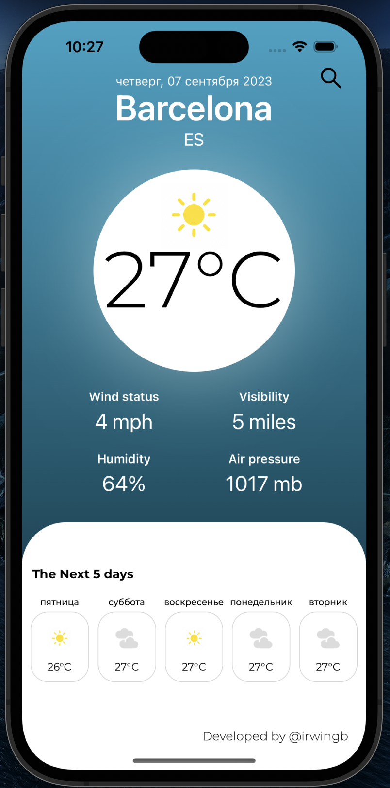
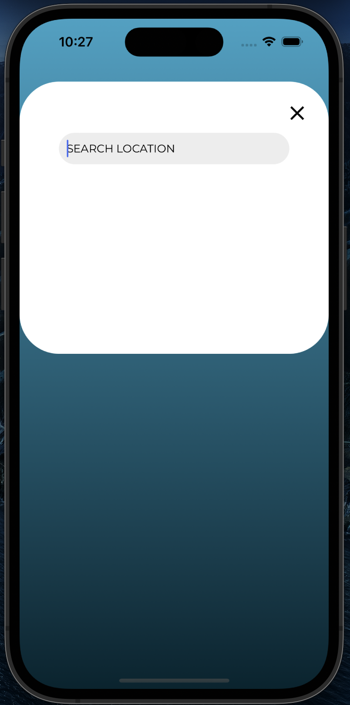

# Neobis_iOS_WeatherApp

## Overview

The iOS Weather App is a feature-rich mobile application that allows users to access real-time weather information for various locations. This app provides essential weather details, including temperature, wind speed, humidity, visibility, and more. Users can simply search for weather data by entering the name of a city, and the app will retrieve the latest weather information from an online weather service.

UIScreens

<table align="center">
  <tr>
    <th>Current Weather Page</th>
    <th>Week Weather Page</th>
  </tr>
  <tr>
    <td></td>
    <td></td>
  </tr>
</table>

## Features

- **Current Weather:** View the current weather conditions, including temperature, weather description, and location details.

- **5-Day Weather Forecast:** Access a 5-day weather forecast with maximum and minimum temperatures, weather icons, and descriptions for each day.

- **Wind Speed:** Get information about the wind speed in miles per hour (mph) for the current location.

- **Humidity:** Check the humidity percentage for the current location.

- **Visibility:** Find out the visibility range in miles for the current location.

- **Air Pressure:** Access the air pressure in millibars (mb) for the current location.

- **Search by City:** Enter the name of any city worldwide to retrieve its weather information.

- **Responsive Design:** The app features a user-friendly interface with a responsive design, making it suitable for various iOS devices.

## Acknowledgments

This Weather app was created by Askar Soronbekov.
